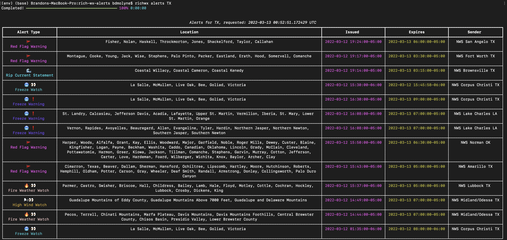
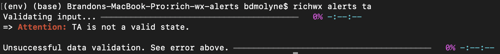
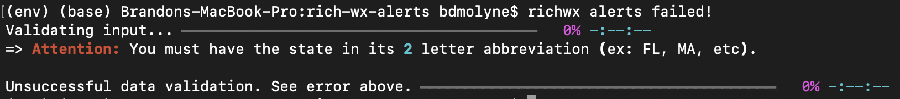

# RichWx
A CLI tool to display weather alerts in the terminal using the Rich library. This is a for fun python package that leverages Rich and NWSAPy to display weather information in your terminal. Here's an example of when `richwx alerts TX` is ran:



To install, it is recommended to create a virtual environment:

```
python -m venv env
source env/bin/activate
```

or on windows:
```
python -m venv env
./env/Scripts/activate
```
From here, install it using pip: `pip install richwx`

Open a new terminal and type: `richwx intro`

You should see a little introduction screen with some capabilities the CLI tool utilizes.

## User Agent
The user agent is required by the National Weather Service API. It's essentially "metadata" that the maintainers would like to have in the event there's a security issue with the application. This information is not stored anywhere except for outside of your computer.

You can control what the user agent is set to by checking its value: `richwx check-user-agent`

You can set the value: `richwx set-user-agent [contact]`, where [contact] is your information.

!! IMPORTANT !!
> It's always better safe than sorry, don't put any personal information here that you might not want in the wrong hands. This information is only sent to the API in a header format, but it is saved _locally_ in your virtual environment. See below to purge this information.

If you wish to purge this information: `richwx purge-user-agent`. This will reset the values to their default.

Using RichWx
------------
Type ``richwx --help`` to pull up a help menu. At any point, you can pull up a help menu
by appending ``--help`` to the end of the command.

The only functionality that is implemented is alerts by state. That is: `richwx alerts [state]`. If you input an invalid 2 letter state abbreviation, you will recieve an error:



Similarily, an invalid state will throw an error:


Developers Note
---------------
That's it. That's the documentation. If you have questions, reach out to me. I don't plan on maintaining this package outside of the weekend I threw this together, but if there's enough community support and features folks want to see, then I'd be happy to further develop thE package.


