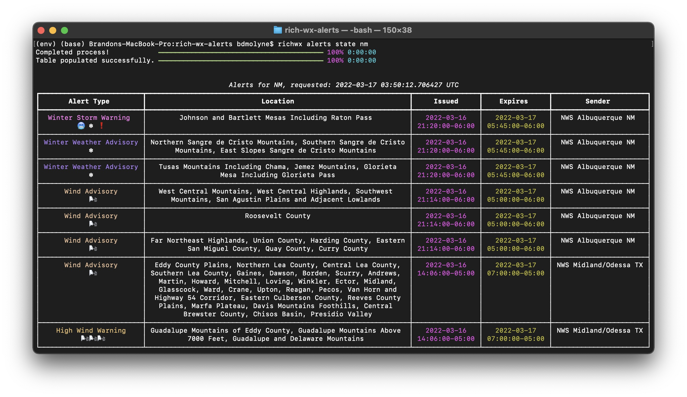
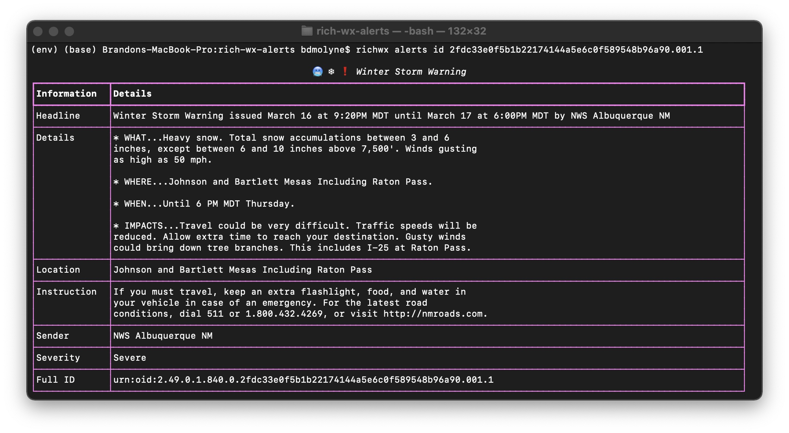

# RichWx
A CLI tool to display weather alerts in the terminal using the Rich library. This is a for fun python package that leverages Rich, NWSAPy, and Click to display weather information in your terminal. Here's an example of when `richwx alerts state TX` is ran:



To install, it is (highly) recommended to create a virtual environment:

```
python -m venv env
source env/bin/activate
```

or on windows:
```
python -m venv env
./env/Scripts/activate
```

From here, install it using pip: `pip install richwx`. You can also install it directly into your base environment (i.e. without setting up a virtual environment), but it's generally good practice to not install anything to your local machine's base environment.

Open a new terminal and type: `richwx intro` - this will print out a nice little intro and confirm for you that the package works as intended. If you get errors, please open an issue.

## User Agent
The user agent is highly encouraged by the National Weather Service API maintainers. It's essentially "metadata" that the maintainers would like to have in the event there's a security issue with the application; they use it as a method to contact you. This information is only stored within the environment. See [the API docs](https://www.weather.gov/documentation/services-web-api) for more information.

All user agent-related content can be found under `auth` (i.e. `rich auth ...`).

- You can control what the user agent is set to by checking its value: `richwx auth check`.
- You can set the value: `richwx auth set [contact]`, where [contact] is your information.
- To reset the value to it's default, use `richwx auth purge`.

> It's always better safe than sorry, don't put any personal information here that you might not want in the wrong hands. This information is only sent to the API in a header format, but it is saved _locally_ in the current environment.

## Using RichWx
At any point, you can type `--help` to get additional information about the specific command. I.e. `richwx alerts --help`.

### Alerts by State
The Alerts leverage the `/alerts` endpoint within the API. Simply

Type ``richwx --help`` to pull up a help menu. At any point, you can pull up a help menu
by appending ``--help`` to the end of the command.

The only functionality that is implemented is alerts by state. That is: `richwx alerts state [state]`. You can input the full name of the state or the 2 letter abbreviation.

By adding the flag `--show-id`, the ID to the specific alert will show it's associated ID. This is necessary to be able to look at individual details of a specific alert.

### Alerts by ID
If you get the alerts by ID (i.e. `richwx alerts id [id]`), you'll be able to pull up specific information about the alert:



Developers Note
---------------
That's it. That's the documentation. If you have questions, reach out to me. If there is enough community support, I will be more than happy to maintain the package and continue development with features the community would like to see.

I do also allow others to contribute to this package and make suggestions. If you would like to make a suggestion, please do not open an issue, but rather post in the [ideas discussion board](https://github.com/WxBDM/richwx/discussions/categories/ideas) on GitHub.


